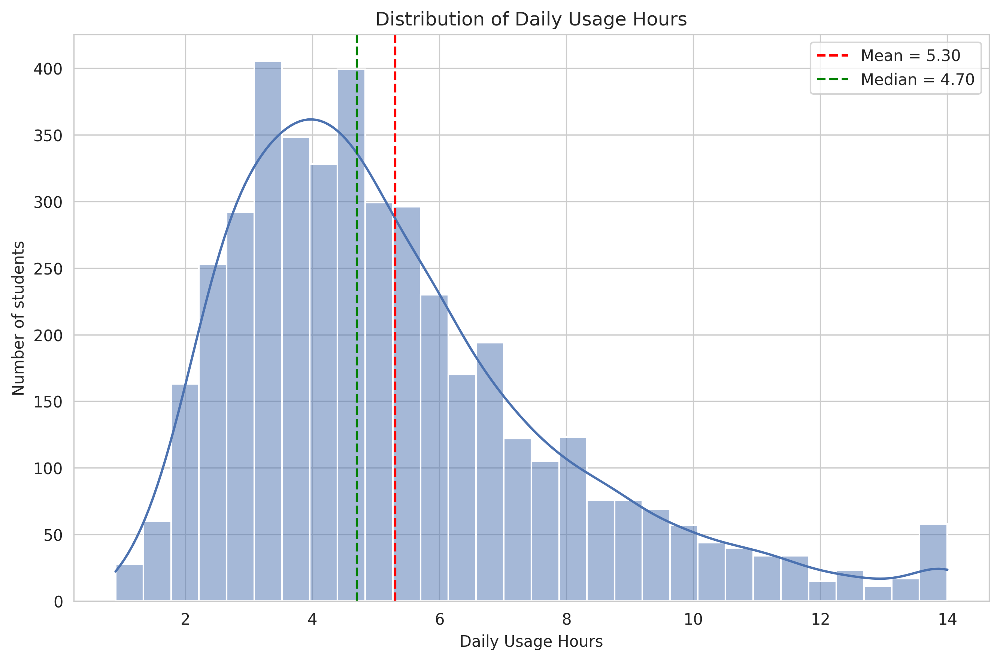

# Like, Scroll, and Stress: The Screen Time vs Mental Health

## Introduction
ผลกระทบของโซเชียลมีเดียต่อสุขภาพจิตเป็นประเด็นที่ได้รับความสนใจเพิ่มขึ้นต่อเนื่องตั้งแต่ปี 2023 เมื่อสำนักงานศัลยแพทย์ใหญ่แห่งสหรัฐฯ ประกาศให้เป็นปัญหาสาธารณสุขเร่งด่วน [(Office of the Surgeon General, 2023)](https://www.singlecare.com/blog/social-media-and-mental-health-statistics/) ผลสำรวจในปี 2025 พบว่าผู้ใช้กว่า 37% รู้สึกว่าโซเชียลมีเดียส่งผลเชิงลบต่อสุขภาพจิตของตน [(Statista, 2025)](https://statista.com/statistics/1369032/mental-health-social-media-effect-us-users) และงานวิจัยในต้นปี 2026 ยังคงยืนยันความสัมพันธ์ระหว่างการใช้งานมากเกินไปกับผลลัพธ์ด้านสุขภาพจิตที่แย่ลง [(PubMed, 2026)](https://pubmed.ncbi.nlm.nih.gov/41731670/)

อย่างไรก็ตาม งานวิจัยกลางปี 2026 เริ่มชี้ว่าปัจจัยสำคัญไม่ใช่ระยะเวลาการใช้งานโดยรวม แต่เป็นพฤติกรรมการใช้งาน เช่น การเลื่อนดูเนื้อหาแบบไม่มีที่สิ้นสุด [(Mental Momentum Research, 2026)](https://research.mental-momentum.ai/r/social-media-use-mental-health-outcomes-rhjbfr) โดยกลุ่มวัยหนุ่มสาว (18-34 ปี) มีคะแนนสุขภาพจิตต่ำกว่าผู้สูงวัยอย่างชัดเจน [(Sapien Labs, 2025-2026)](https://research.mental-momentum.ai/r/social-media-use-mental-health-outcomes-rhjbfr) ขณะที่งานวิเคราะห์ล่าสุดในเดือนสิงหาคม 2026 ก็ยอมรับว่าโซเชียลมีเดียมีทั้งประโยชน์และโทษควบคู่กัน [(Worldatnet, 2026)](https://www.worldatnet.com/2026/08/httpswww.worldatnet.com202608mental-health-in-age-of-social-media-2026.html.html)

จากบริบทนี้ การศึกษาความสัมพันธ์ระหว่างพฤติกรรมการใช้โซเชียลมีเดีย การนอนหลับ ความเครียด และสุขภาพจิตของนักเรียนนักศึกษา จึงมีความสำคัญในการหาปัจจัยที่แท้จริงที่ส่งผลต่อสุขภาวะ เพื่อนำไปสู่แนวทางแก้ไขที่ตรงจุด

## Initial Question
ในปัจจุบัน มีการใช้งานโซเชียลมีเดียจำนวนมากและหลายภาคส่วนเริ่มกังวลถึงผลกระทบจากการใช้งานที่มากเกินไป เช่นในกรณีของหลายประเทศ ที่เริ่มมีการแบนหรือจำกัดการใช้งานสมาร์ทโฟนในโรงเรียนดังเนื้อหาส่วนหนึ่งในข่าวที่ระบุไว้ว่า  ['social media environments can expose young people, particularly girls, to risks such as harassment, unrealistic social pressures and harmful content'](https://www.unesco.org/gem-report/en/articles/how-many-countries-have-phone-bans-school) พวกเราจึงมีการตั้งข้อสงสัยว่าจริงๆแล้วการใช้โซเชียลมีเดียเป็นปริมาณแค่ไหน ถึงจะเรียกว่ากำลังพอดี ซึ่งคำถามแรกๆที่เราสงสัยจากข้อมูลที่ได้ประกอบด้วย

- ระยะเวลาในการใช้โซเซียลต่อวันมีผลอย่างไรต่อสุขภาพจิต ความเครียด และผลการเรียน
- แต่ละช่วงวัยมีพฤติกรรมอย่างไรในการเล่นอินเตอร์เน็ต
- ระดับการศึกษามีผลต่อการชั่วโมงการเล่นโซเซียลไหม
- การเล่นโซเซียลที่มากอาจทำให้นอนดึกและมีช่วงการนอนน้อยและอาจส่งผลต่อสุขภาพจิต
- ผู้หญิงและผู้ชายอาจมีพฤติกรรมการใช้งานโซเชียลมีเดียที่ต่างกัน และอาจมี mental health ที่แตกต่างกัน

## Data Scope
โปรเจกต์นี้ใช้ชุดข้อมูล [Impact of Social Media on Life](https://www.kaggle.com/datasets/harishyadav0506/impact-of-social-media-on-life) จากเว็บไซต์ Kaggle ซึ่งเก็บข้อมูลจากกลุ่มนักเรียนและนักศึกษาในปีค.ศ. 2026 จำนวน 4,500 คน ในช่วงอายุตั้งแต่ 15-26 ปี โดยข้อมูลที่ใช้ในโปรเจกต์ จะมีหัวข้อดังนี้

- **ข้อมูลประชากร (Demographics):**
  - อายุ (Age)
  - เพศ (Gender)
  - ระดับการศึกษา (Academic Level; High School, Undergraduate, Postgraduate)
- **ตัวชี้วัดการใช้งาน (Usage Metrics):**
  - ประเภทแพลตฟอร์ม (Primary Platform)
  - จำนวนชั่วโมงที่ใช้โซเชียลต่อวัน (Daily Usage Hours)
- **ตัวชี้วัดพฤติกรรมการนอน (Sleep Behavior Indicators):**
  - จำนวนชั่วโมงการนอน (Sleep Duration Hours)
  - การใช้โซเชียลช่วงดึก (Late Night Usage: True/False)
  - คะแนนคุณภาพการนอน (Sleep Quality Score: 1-5)
- **ผลลัพธ์ (Outcome):**
  - ผลการเรียน (Academic Performance GPA)
  - คะแนนวัดค่าความเครียด (Perceived Stress Score: 0–40)
  - ดัชนีสุขภาพจิต (Mental Health Index: 0–100)

## Primary Methodology
[ใส่รูป correlation + ระบุว่าใช้ Pearson R (+เหตุผล)]
จาก Initial Question ที่กล่าวไปข้างต้น เราจะตรวจสอบความสัมพันธ์ของแต่ละข้อมูล โดยคำนวณและพิจารณาจาก**ค่าสัมประสิทธิ์สหสัมพันธ์ (Correlation Coefficient)** ดังนี้
Daily Usage Hours กับ Mental Health Index, Perceived Stress Score, Academic Performance GPA, Age Range, Academic Level, Sleep Duration Hours

## เนื้อหา
<h1 align="left">
1. นักเรียน/นักศึกษาเล่นโซเชียลมีเดียกันมากแค่ไหน?
</h1>

<i>Figure 1.การกระจายตัวของระยะเวลาการใช้โซเซียลจากกลุ่มตัวอย่างข้อมูล</i>

จากกระจายตัวของข้อมูลจะพบว่าข้อมูลมีการกระจายตัวของชั่วโมงการใช้งานโซเชียลมีเดียตั้งแต่ 0.9 ชั่วโมงจนถึง 14 ชั่วโมง ซึ่งจากกลุ่มตัวอย่าง คนส่วนมากใช้งานโดยเฉลี่ยวันละ 5.3 ชั่วโมงและมีค่ามัธยฐานอยู่ที่ 4.7 ชั่วโมงต่อวัน และยังมีคนอีกจำนวนมากที่ใช้งานนานไปจนถึง 14 ชั่วโมงต่อวัน ซึ่งไม่น่าจะเป็นการใช้งานเป็นผลดีต่อสุขภาพจิตซึ่งเราจะมาหาความสัมพันธ์ในกราฟต่อๆไป

